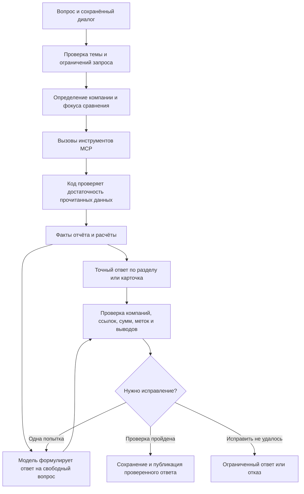

# Что изменилось в агенте v7

Цель — точный ответ на текущий вопрос о выбранной компании. Модель не должна заново сочинять уже вычисленные суммы, даты, банковские метки и обязательные факты.

## Код и модель

| Часть | Как работает |
|---|---|
| Банковские метки | Копируются из отчёта. Агент не пересчитывает светофор или ЗСК. |
| Факты и вывод карточки | Правила `signals`; карточка собирается кодом. В полной проверке сохраняются обязательные факты, включая объяснения статуса и ограничения данных. Это правила помощника по снимку отчёта, а не новый банковский скоринг. |
| Выручка, прибыль, капитал, ликвидность | Код выбирает нужный год и показатель. Отсутствующее значение не превращается в ноль; ликвидность требует обоих исходных показателей. |
| Суды и приставы | Разделяются роли, действующие и завершённые записи, общая сводка и ограниченное окно по годам. Неизвестная сумма не равна отсутствию требования. |
| Телефоны, email, лицензии, учредители, возраст | По поддерживаемым запросам — значения из соответствующих полей и вычисления по датам. Руководитель не подставляется вместо собственника. |
| Компания в диалоге | Модель участвует в поиске, код ограничивает допустимые ИНН и хранит текущую компанию отдельно от исходной группы сравнения. Неизвестный новый ИНН не наследует факты старой компании. |
| Текущий статус известной компании | Однозначное уточнение проходит через MCP и проверку без вызова модели. Сообщается предел актуальности и статус сохранённого отчёта. Новое название или другой ИНН этот путь не обходят. |
| Свободные вопросы и объяснения | Модель использует факты текущего хода. Контекст прошлых вопросов помогает понять продолжение темы, но прежний ответ модели не становится источником фактов. |
| Достаточность источников | Для распознанного вопроса код задаёт обязательные чтения; недостающие вызовы MCP попадают в трассу. Дополнительные поля, использованные детерминированным ответом, пока не всегда полностью отражены в контексте автоматического судьи — это зафиксированный пробел трассировки. |
| Проверка ответа | Проверяются область компании, адреса полей, часть числовых утверждений, видимые денежные суммы, явные банковские метки и противоречащие выводы сравнения. Это не универсальная проверка истинности любого предложения. |
| Публикация | Промежуточные рассуждения и неподтверждённые черновики не отправляются в SSE. Клиент получает проверенный итоговый текст. |
| Ограничения сервиса | Четыре активных запроса на процесс, общий бюджет ожидания 30 секунд, выполнение до 120 секунд. Запросы одного диалога выполняются последовательно. |
| История | SQLite в отдельном постоянном каталоге. Обновление контейнера не заменяет базу чатов. |

## Важные границы

Агент использует структурированный снимок банковского отчёта. MCP — интерфейс инструментов, а не механизм распознавания PDF. Приём сырой PDF, OCR и подтверждённый промышленный контракт API Альфа-Банка этой работой не реализованы.

Текст отчёта рассматривается как данные. Получение свежей выписки, проверка проведённого платежа, поиск домашнего адреса и обновления из внешнего интернета не имитируются. При запросе текущего состояния агент обозначает дату доступного отчёта и предел своих возможностей.

Проверки текста не доказывают семантическую корректность всех утверждений. Например, существующая ссылка на составной объект сама по себе не подтверждает каждое слово комментария; совпадение суммы с одним из полей не доказывает её правильное отнесение к году или роли. Поэтому для промышленной приёмки остаются нужны независимая разметка и проверка специалистами.

## Где смотреть код

- `src/contractor_agent/agent/nodes.py` — последовательность шагов и сохранение фокуса.
- `question.py`, `evidence.py` — предмет запроса и необходимые источники.
- `card_answer.py`, `financial_answers.py`, `section_answers.py`, `factual_sections.py`, `scoped_answers.py`, `comparison_answers.py` — ответы по поддерживаемым сценариям.
- `citations.py`, `money_guard.py`, `presentation.py` — проверки и оформление.
- `runtime.py`, `stream.py` — очереди, сроки, запись диалога и поток ответа.
- `src/contractor_agent/mcp_server/tools.py` — содержание инструментов и происхождение данных.
