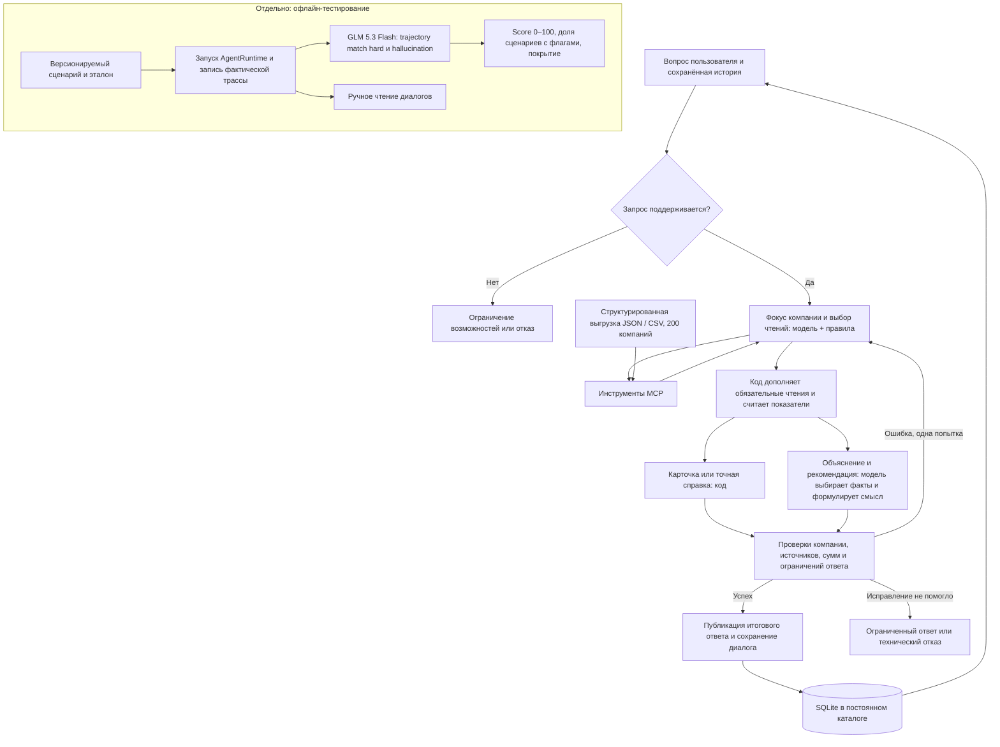

# Как работает текущий агент v8

Состояние стенда на 07.09.2026: код `b899b40`, GPT-OSS-20B через Polza. Схема разделяет пользовательский запрос и офлайн-тестирование. Она отражает логические обязанности компонентов, а не сетевую топологию.

## Кто за что отвечает

| Участок | Ответственность |
|---|---|
| Компания и история | Код хранит текущую компанию отдельно от группы сравнения. Модель помогает понять запрос и выбрать инструменты. Явно названный новый ИНН не наследует факты старой компании. |
| Доступ к отчёту | MCP-инструменты читают структурированный снимок. Это не загрузка свежей выписки, не чтение интернета и не OCR сырой PDF. |
| Расчёты и сигналы | Код выбирает год, суммирует нужные записи, разделяет судебные роли и статусы, рассчитывает показатели при наличии исходных данных. Банковские светофор и ЗСК копирует из отчёта. |
| Карточка | Код формирует факты и итог по правилам помощника. Цвета фактов отражают эти правила, а не новый банковский скоринг. |
| Прямой ответ v8 | Для решения или объяснения модель получает проверяемые факты с идентификаторами и ограничениями, формулирует вступление и выбирает доказательства. Код подставляет тексты выбранных фактов. Свободный комментарий всё равно может ошибаться. |
| Проверка | Валидаторы проверяют допустимые компании, ссылки, часть числовых утверждений, банковские метки и противоречащие выводы. Проверка существования поля не доказывает смысловую истинность любого предложения. |
| Исправление | При выявленной проблеме граф допускает один круг исправления. Затем публикует проверенный итог либо ограниченный ответ. Некоторые точные запросы проходят детерминированную ветку без обращения к модели. |
| Показ и хранение | API отправляет итог через SSE после проверок. Промежуточные черновики не являются видимым ответом. SQLite лежит в постоянном каталоге вне заменяемого контейнера. |
| GLM-судья | Работает при запуске тестов на сохранённых видимых ответах и реальных вызовах инструментов. Не участвует в обычной обработке запроса пользователя. |

## Где сверять с реализацией

- [graph.py](../../src/contractor_agent/agent/graph.py): маршрут `agent ↔ tools`, затем `evidence → finalize → validate`, возврат при исправлении.
- [nodes.py](../../src/contractor_agent/agent/nodes.py), [interpretation.py](../../src/contractor_agent/agent/interpretation.py): фокус компании, составление ответа, план интерпретации и ограничения.
- [evidence.py](../../src/contractor_agent/agent/evidence.py), [citations.py](../../src/contractor_agent/agent/citations.py), [money_guard.py](../../src/contractor_agent/agent/money_guard.py): обязательные чтения и проверки.
- [MCP-инструменты](../../src/contractor_agent/mcp_server/tools.py), [ReportSource](../../src/contractor_agent/data/loader.py): источник данных.
- [FRAMEWORK_MIGRATION.md](FRAMEWORK_MIGRATION.md): тестовый мост, версии эталона и методика судьи.

## Что требуется от банка для пилота

Нужно согласовать контракт источника отчётов, доступ по ИНН и права пользователя, актуальность данных и ошибки API. Замена `ReportSource` на банковский источник является планом интеграции, а не уже подтверждённой возможностью API Альфа-Банка. Текущий одиночный VPS и общий доступ демонстрационного стенда не заменяют промышленную модель авторизации, резервирования и наблюдения за сервисом.
